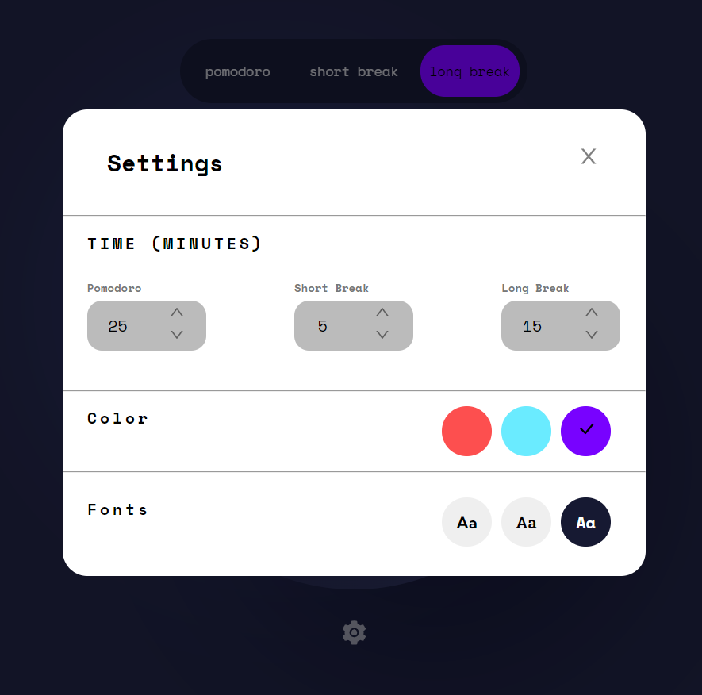

# Pomodoro App
#### This project is the one of the Frontend Mentor [Challenges](https://www.frontendmentor.io/challenges/pomodoro-app-KBFnycJ6G). This project build for Pomodoro Technique which is a time management technique. This technique developed by Francesco Cirillo at late 1980's.In the technique, work is traditionally broken up by short breaks, 25 minutes long.

#### In the application, there are 3 different countdown counters as Pomodoro, short break and long break.

#### These counters have default time values; pomodoro 25 minutes, long break 15 minutes and short break 5 minutes.

#### You could change this values. Also these counters can be stopped and restarted as desired.


## Used technologies & Methodology

- The application is written with the React library.
- Scss is used for styling and React-Icon Library is used for icons.
- Redux-toolkit is used for store managment.
- Framer-Motion is used for animations.

#### The Pomodoro App can start the countdown at any desired timer. You cannot switch to another counter without stopping the current counter. It gives a warning if you try to change it


#### In the application, there is an icon that opens the settings panel under the counter. Font-style, Counter color and counter time values colud change with it.




## How To Run

### Requirements

- Node.js
- npm
- GitBash

### Kurulum Adımları

- Download project or clone it: 

```
git clone https://github.com/kadirgurturk/Pomodoro-App.git
```
- Go to the project directory:  
```
cd datagrid
```
- Install Dependencies: 
```
npm install
```
- Run it: 
```
npm run dev
```


## Türkçe
#### Bu uygulama Frontend Mentor [Challenge'larından](https://www.frontendmentor.io/challenges/pomodoro-app-KBFnycJ6G) biridir. Bu uygulama bir zaman yönetim tekniği olan Pomodoro tekniği için yapılmıştır. Bu teknik, 1980'lerin sonunda Francesco Cirillo tarafından geliştirilen bir zaman yönetimi yöntemidir. Teknikte, iş geleneksel olarak 25 dakika uzunluğunda, kısa molalarla ayrılır.

### Uygulamada da Pomodoro, short break, long break olarak 3 farklı geriye sayım yapan sayaç bulunur. Bu sayaçlar istenildiği gibi durdurlabilir ve restart yapılabilir.


## Metotlar ve Teknolojiler
- Uygulama React kütüphanesi ile yazılmıştır.
- Styling için Sass, Iconlar için React-Icon Kütüphanesi 
- Store Yönetimi için ReduxToolkit
- Animasyonlar için Framer-Motion kullanılmıştır.

#### Pomodoro App uygulamasında istenilen sayaçtan geri sayım başlatılır.Geri sayım ile birlikte yuvarlak bar'da azalır. Geri sayım devam ederken başka bir sayaça geçilemez, geçilmeye çalışılırsa bir popup ile uyarı verilir.


#### Uygulamada ayrıca aşağıda ayarlar panelini açan bir icon bulunmaktadır. Ayarlar panelinde sayaçların süreleri, arka plan rengi ve font değişimi yapılabilimektedir.


